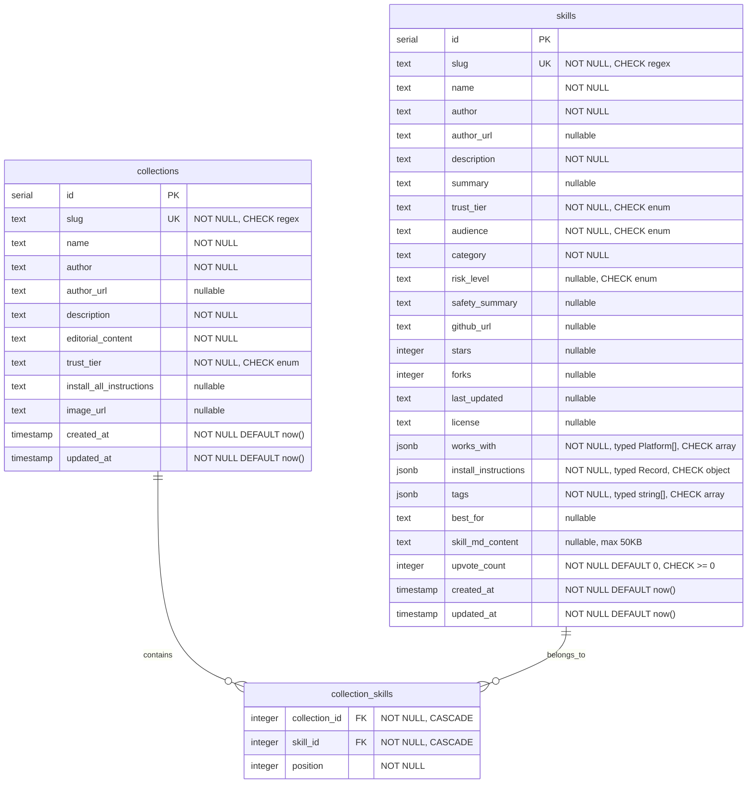

# feat: SkillsTube MVP — Curated Skills Directory

## Enhancement Summary

**Deepened on:** 2026-03-20
**Agents used:** 7 review agents (TypeScript, architecture, security, performance, simplicity, data integrity, frontend races) + 2 research agents (framework docs, best practices)

### Critical Issues Resolved
1. **Static pages vs. dynamic upvotes** — pages use `generateStaticParams` but upvote counts are dynamic. Resolved: UpvoteButton hydrates count client-side from `initialCount` prop; pages use `revalidate = 60` for ISR
2. **Seed script data loss** — re-seeding would reset upvote_count to 0. Resolved: exclude `upvoteCount` from upsert ON CONFLICT clause
3. **Upvote race condition** — read-then-write pattern loses concurrent votes. Resolved: atomic SQL increment with `RETURNING`

### Key Improvements Added
- JSONB columns typed with `.$type<T>()` and CHECK constraints
- Upvote button state machine (IDLE → PENDING → UPVOTED/ERRORED) preventing double-clicks
- Basic IP rate limiting on upvote API
- Markdown rendered server-side (zero client bundle cost)
- Hydration-safe localStorage reads (STATE_INITIALIZING pattern)
- JSON-LD structured data for SEO
- Search input uses local state with debounced URL sync (prevents lost keystrokes)
- Composite PK + cascade deletes on collection_skills
- Security headers (CSP) enumerated

---

## Overview

Build and ship a curated skills directory for Claude Code and Cowork users over a weekend. The site surfaces 20-30 hand-picked skill stacks with editorial curation and trust/safety badges, targeting both developers and non-technical users. The differentiator is trust — quality over quantity.

## Problem Frame

500K+ skills scattered across GitHub with no quality signal. Existing directories are developer-only scrapers with no curation or safety verification. Non-technical Cowork users are completely underserved. SkillsTube launches as a curated editorial site with trust scoring, deferring the automated long-tail scraper to week 2+. (see origin: docs/brainstorms/2026-03-20-skillstube-mvp-requirements.md)

## Requirements Trace

- R1-R7. Homepage: hero, featured stacks, browse by audience/role/category, recently added, persistent search bar
- R8-R17. Skill detail page: trust badge, safety summary, works-with badges, GitHub stats, install instructions with copy, upvote, collections, SKILL.md preview
- R18-R20. Collection pages: editorial write-up, ordered skill list, install-all instructions
- R21-R23. Browse/search: client-side search/filter, filter by audience/trust/category/platform, card grid
- R24-R25. Trust system: five tiers with colour-coded badges, manually assigned
- R26-R27. Content: 20-30 curated skills with editorial summaries, trust tiers, audience tags, works-with, install instructions
- R28-R31. Upvotes: anonymous, one per skill per browser (localStorage), persisted in DB
- R32-R33. General: mobile responsive, light/modern/airy visual direction

## Scope Boundaries

- No GitHub scraper or long-tail catalogue (see origin)
- No automated safety scanning — trust tiers manually assigned (see origin)
- No side-by-side compare feature (see origin)
- No user auth, reviews, or submit-a-skill flow (see origin)
- No email digest or API (see origin)
- No live GitHub API calls — star/fork counts are snapshot data in seed files (see origin)

## Context & Research

### Relevant Code and Patterns

Conventions established across `agent_si` and `simonstephens.ai`:

- **Framework:** Next.js (App Router), TypeScript, Tailwind v4 CSS-first config
- **ORM:** Drizzle ORM with postgres.js driver
- **DB pattern:** `db/schema.ts` + `db/client.ts` (global singleton) + `db/index.ts` (server-only guard)
- **Components:** `components/layout/`, `components/sections/`, `components/ui/` with PascalCase filenames
- **Utility:** `cn()` helper via `clsx` + `tailwind-merge` at `lib/utils.ts`
- **Styling:** `@theme` block in `globals.css` for design tokens, no `tailwind.config.js`
- **Deployment:** `railway.json` with healthcheck, `next start -p ${PORT:-3000} -H 0.0.0.0`
- **Config:** `output: 'standalone'` in `next.config.ts`, security headers, `@/*` path alias
- **Package manager:** npm
- **ESLint:** flat config with `eslint-config-next`

Reference files:
- `~/Projects/agent_si/db/schema.ts` — Drizzle schema pattern (uses `.$type<T>()` for JSONB)
- `~/Projects/agent_si/db/client.ts` — DB client singleton
- `~/Projects/agent_si/railway.json` — Railway deploy config
- `~/Projects/simonstephens.ai/lib/utils.ts` — `cn()` utility
- `~/Projects/simonstephens.ai/app/globals.css` — Tailwind v4 `@theme` pattern

### Institutional Learnings

No `docs/solutions/` exist yet — greenfield project.

### External References

- Next.js 15 App Router: Server Components for pages, Client Components only for interactive widgets. `params` is now a `Promise` and must be awaited. `fetch` no longer cached by default.
- Drizzle ORM: define schema in TypeScript, `drizzle-kit push` for dev, `drizzle-kit generate` + `drizzle-kit migrate` for production. Zero generate step. postgres.js auto-serializes JSONB (no `JSON.stringify` needed).
- shadcn/ui: full Tailwind v4 support, OKLCH colors, `data-slot` attributes. `npx shadcn@latest init -t next`.
- Client-side search: custom `Array.filter()` sufficient for <50 items, zero dependencies.
- Railway: auto-detects Next.js, `output: 'standalone'` for smaller deploys, `DATABASE_URL` auto-injected.
- SEO: JSON-LD with `SoftwareApplication` schema for skill pages, `CollectionPage` + `ItemList` for browse pages. Use `generateMetadata` on every dynamic route.
- Trust badge UX: icon + label (not just icon), consistent sizing, tooltip explaining tier. Layer trust signals (badge + safety summary + GitHub stats).
- Directory sites: grid layout default, card-based browsing, filter sidebar on desktop, bottom sheet on mobile.

## Key Technical Decisions

- **Drizzle ORM, not Prisma:** Matches existing conventions in agent_si. No generate step means faster iteration. Lighter bundle.
- **shadcn/ui for components:** Already compatible with the `cn()` utility pattern. Copies source into project for full control. Fast to scaffold.
- **Custom Array.filter() for search:** Zero dependencies, perfectly adequate for <30 skills. Upgrade to Fuse.js later if fuzzy matching is needed.
- **TypeScript seed files → Drizzle seed script → Postgres:** Curated data lives in version-controlled TypeScript files under `content/`. A seed script loads them into Postgres. This keeps content reviewable in PRs while enabling DB-backed features like upvotes.
- **JSONB columns with `.$type<T>()`:** `works_with`, `install_instructions`, and `tags` typed at the schema level for compile-time safety. NOT NULL with empty defaults. CHECK constraints validate shape at the DB level.
- **Const arrays for enum types:** `TRUST_TIERS`, `AUDIENCES`, `PLATFORMS` defined as `as const` arrays with derived union types. One source of truth for both type-checking and rendering filter dropdowns.
- **Denormalized upvote_count with atomic increment:** Simple integer counter using `sql\`upvote_count + 1\`` (not read-then-write). No separate upvotes table for MVP.
- **Static shell + client-side upvote hydration:** Pages use `generateStaticParams` with `revalidate = 60` for ISR. UpvoteButton receives `initialCount` from server, manages live count client-side.
- **Server-side markdown rendering:** SKILL.md content rendered to HTML on the server. Markdown parser never ships to the browser (zero client bundle cost).
- **react-markdown for XSS-safe rendering:** Does not render raw HTML by default. Do NOT enable `rehype-raw`.
- **Light theme default:** Deliberate departure from existing projects. Light-first design tokens in `@theme`.
- **Basic IP rate limiting on upvote API:** In-memory Map with sliding window (10 upvotes per IP per hour). Prevents trivial curl-loop abuse.

## Open Questions

### Resolved During Planning

- **Install instructions format:** JSON object keyed by platform. Rendered as shadcn Tabs with per-platform copy buttons. Remember last-selected platform in localStorage for cross-page persistence.
- **SKILL.md preview approach:** Server-side markdown rendering with react-markdown. Output wrapped in a native `<details>` element (no shadcn Collapsible needed). Truncate content at 50KB in seed data with "View full content on GitHub" link.
- **Data seeding approach:** TypeScript files in `content/`. Seed script uses upsert (ON CONFLICT on slug), excludes `upvoteCount` from update set, wraps in transaction, garbage-collects removed entries.
- **Client-side search mechanism:** Custom filter using `Array.filter()`. Search input uses local React state (not URL params) for responsive typing. URL params synced via debounced `router.replace` (300ms trailing).
- **Component library:** shadcn/ui — `card`, `badge`, `button`, `input`, `tabs`. Use native `<details>` for collapsible SKILL.md, native `<select>` for filter dropdowns.
- **Static vs dynamic data tension:** Static pages with `revalidate = 60` for ISR. UpvoteButton hydrates count client-side from `initialCount` prop. Also add `GET /api/skills/[slug]/upvote` for on-mount count fetch.
- **Column nullability:** Required: `slug`, `name`, `author`, `description`, `trust_tier`, `audience`, `category`, `works_with`, `install_instructions`, `tags`, `upvote_count`. Optional: `author_url`, `summary`, `risk_level`, `safety_summary`, `github_url`, `stars`, `forks`, `last_updated`, `license`, `best_for`, `skill_md_content`.

### Deferred to Implementation

- **Verify all 16 listed skill stacks are real and active:** Needs research during content creation. Some may need substitutes.
- **Exact design tokens:** Start with shadcn/ui defaults adjusted for light theme. Refine during implementation.
- **Error/empty states:** 404 page, empty search results — details emerge during implementation.

## High-Level Technical Design

> *This illustrates the intended approach and is directional guidance for review, not implementation specification. The implementing agent should treat it as context, not code to reproduce.*

### Data Model (ERD)



**Schema constraints (from data integrity review):**
- `collection_skills`: composite PK on `(collection_id, skill_id)`, unique index on `(collection_id, position)`
- Foreign keys use `ON DELETE CASCADE`
- CHECK constraints: `trust_tier IN (...)`, `audience IN (...)`, `risk_level IN (...)`, `slug ~ '^[a-z0-9]+(-[a-z0-9]+)*$'`
- JSONB CHECK: `jsonb_typeof(works_with) = 'array'`, `jsonb_typeof(tags) = 'array'`, `jsonb_typeof(install_instructions) = 'object'`

### Type System

```
// Const arrays (single source of truth for types AND runtime iteration)
TRUST_TIERS = ['official', 'verified', 'community', 'unreviewed', 'flagged'] as const
AUDIENCES = ['developer', 'non-technical', 'both'] as const
PLATFORMS = ['claude-code', 'cowork', 'cursor', 'codex', 'claude-ai'] as const
CATEGORIES = ['development', 'productivity', 'security', 'documents', 'design', 'devops', 'research', 'automation'] as const

// Derived types
TrustTier = typeof TRUST_TIERS[number]
Audience = typeof AUDIENCES[number]
Platform = typeof PLATFORMS[number]

// Seed type (omits auto-generated columns)
SkillSeed = Omit<typeof skills.$inferInsert, 'id' | 'createdAt' | 'updatedAt' | 'upvoteCount'>

// Serialized type (for Server→Client boundary, Dates become strings)
SerializedSkill = Omit<Skill, 'createdAt' | 'updatedAt'> & { createdAt: string; updatedAt: string }
```

### Page Routing

```
app/
  layout.tsx           → Root layout (nav, footer, light theme)
  page.tsx             → Homepage (R1-R7)
  sitemap.ts           → Dynamic sitemap for all skills/collections
  skills/
    [slug]/page.tsx    → Skill detail (R8-R17) — generateStaticParams + revalidate=60
  collections/
    [slug]/page.tsx    → Collection page (R18-R20) — generateStaticParams + revalidate=60
  browse/
    page.tsx           → Browse/search with filters (R21-R23)
  api/
    skills/
      [slug]/
        upvote/route.ts → POST (increment) + GET (current count)
```

### Data Flow

```
content/skills.ts ──→ scripts/seed.ts ──→ Railway Postgres
content/collections.ts ─┘  (upsert,          │
                            excl. upvotes,    ↓
                            in transaction)   Server Components (Drizzle queries via db/queries.ts)
                                              │
                                              ↓
                                 Static HTML (generateStaticParams + ISR revalidate=60)
                                              │
                                 ┌────────────┤
                                 ↓            ↓
                         Client Components   API Routes
                         (search/filter,     (POST+GET /api/skills/[slug]/upvote)
                          upvote button,      │ ← IP rate limit (in-memory)
                          copy button)        ↓
                                           Postgres (atomic increment + RETURNING)
```

## Implementation Units

- [ ] **Unit 1: Project Scaffold & Foundation**

  **Goal:** Set up the Next.js project with all conventions matching existing projects, including shadcn/ui, Drizzle config, base layout, and Railway config.

  **Requirements:** Foundation for all requirements. R32 (mobile responsive), R33 (visual direction).

  **Dependencies:** None

  **Files:**
  - Create: `package.json`, `tsconfig.json`, `next.config.ts`, `eslint.config.mjs`
  - Create: `app/layout.tsx`, `app/globals.css`, `app/page.tsx`
  - Create: `components/layout/Header.tsx`, `components/layout/Footer.tsx`
  - Create: `components/ui/` (shadcn components: card, badge, button, input, tabs)
  - Create: `lib/utils.ts` (`cn()` helper)
  - Create: `lib/types.ts` (const arrays: TRUST_TIERS, AUDIENCES, PLATFORMS, CATEGORIES + derived types)
  - Create: `railway.json`, `.gitignore`, `CLAUDE.md`

  **Approach:**
  - Scaffold with `create-next-app` (App Router, TypeScript, Tailwind v4, ESLint)
  - Run `npx shadcn@latest init -t next` then add: card, badge, button, input, tabs
  - Use `next/font` for Geist Sans + Geist Mono (matching existing projects, prevents layout shift)
  - Set up light theme design tokens in `globals.css` via `@theme` — aim for "Notion marketing meets Product Hunt"
  - Trust badge color palette: green (Official/Verified), blue (Community), amber (Unreviewed), red (Flagged) — define as CSS custom properties in `@theme`
  - Header: logo/wordmark left, nav links center, search icon right (expands to full-width input on mobile). Responsive hamburger on mobile
  - Footer: minimal — links, copyright
  - Add `output: 'standalone'` to next.config.ts
  - Security headers in `next.config.ts`: CSP (`default-src 'self'; script-src 'self'; style-src 'self' 'unsafe-inline'; img-src 'self' https:; frame-ancestors 'none'`), `X-Content-Type-Options: nosniff`, `X-Frame-Options: DENY`, `Referrer-Policy: strict-origin-when-cross-origin`, `Permissions-Policy: camera=(), microphone=(), geolocation()`, HSTS
  - Create `railway.json` with healthcheck config
  - Create project CLAUDE.md documenting stack and conventions

  **Patterns to follow:**
  - `~/Projects/simonstephens.ai/app/globals.css` — Tailwind v4 `@theme` pattern
  - `~/Projects/simonstephens.ai/lib/utils.ts` — `cn()` utility
  - `~/Projects/agent_si/railway.json` — Railway config
  - `~/Projects/agent_si/.gitignore` — gitignore template
  - `~/Projects/agent_si/eslint.config.mjs` — ESLint flat config

  **Test scenarios:**
  - App runs locally with `npm run dev`
  - Homepage renders with header and footer
  - Mobile nav collapses to hamburger
  - shadcn components render correctly with light theme

  **Verification:**
  - `npm run build` succeeds
  - Dev server shows homepage with header, footer, and light theme
  - Layout is responsive at mobile breakpoints

---

- [ ] **Unit 2: Database Schema & Seed Infrastructure**

  **Goal:** Define the Drizzle schema with proper typing, constraints, and seed infrastructure. Set up centralized data access layer.

  **Requirements:** Foundation for R8-R17, R18-R20, R24-R25, R26-R27, R28-R31.

  **Dependencies:** Unit 1

  **Files:**
  - Create: `db/schema.ts`
  - Create: `db/client.ts`
  - Create: `db/index.ts`
  - Create: `db/queries.ts` (centralized data access functions)
  - Create: `content/skills.ts` (typed array structure, initially with 1-2 example entries)
  - Create: `content/collections.ts` (typed array structure, initially with 1 example)
  - Create: `scripts/seed.ts`
  - Create: `drizzle.config.ts`
  - Create: `db/migrations/` (generated by drizzle-kit)

  **Approach:**
  - Schema follows the ERD with all constraints documented above
  - Use `.$type<T>()` on all JSONB columns with dedicated type aliases from `lib/types.ts`
  - `upvote_count`: `.notNull().default(0)` with CHECK `>= 0`
  - Enum columns: CHECK constraints for `trust_tier`, `audience`, `risk_level`
  - Slug columns: CHECK constraint matching `/^[a-z0-9]+(-[a-z0-9]+)*$/`
  - `collection_skills`: composite PK on `(collection_id, skill_id)`, unique index on `(collection_id, position)`, CASCADE deletes on both FKs
  - DB client uses global singleton pattern from agent_si
  - `db/index.ts` wraps with `import 'server-only'`
  - `db/queries.ts`: centralized query functions (`getAllSkills`, `getSkillBySlug`, `getCollectionBySlug`, `getCollectionSkills`, `getSkillCollections`). Imports from `db/index.ts` to enforce server-only boundary
  - Create reusable `increment()` helper: `(column: AnyColumn, value = 1) => sql\`${column} + ${value}\``
  - Content files export typed arrays using `SkillSeed = Omit<typeof skills.$inferInsert, 'id' | 'createdAt' | 'updatedAt' | 'upvoteCount'>`
  - Seed script (`scripts/seed.ts`):
    - Validate all entries with Zod schemas before insertion (catches typos in trust tiers, malformed JSONB)
    - Wrapped in a single transaction for atomicity
    - Upsert on `slug` conflict, MUST exclude `upvoteCount` from the ON CONFLICT UPDATE set
    - Insert order: skills first, then collections, then resolve collection_skills join (slug → ID lookup)
    - Garbage-collect: delete skills/collections not in seed files
    - Truncate `skill_md_content` at 50KB with "View on GitHub" suffix

  **Patterns to follow:**
  - `~/Projects/agent_si/db/schema.ts` — table definitions with `.$type<T>()` on JSONB
  - `~/Projects/agent_si/db/client.ts` — global singleton pattern
  - `~/Projects/agent_si/drizzle.config.ts` — Drizzle Kit config

  **Test scenarios:**
  - `drizzle-kit push` creates tables with all constraints
  - `tsx scripts/seed.ts` populates tables from content files
  - Re-running seed is idempotent — does NOT reset upvote counts
  - Zod validation catches malformed data (wrong trust tier, non-array works_with)
  - Removing a skill from seed file deletes it from DB on next seed run
  - Querying via `db/queries.ts` returns properly typed results

  **Verification:**
  - Tables exist with correct columns, constraints, and indexes
  - Seed runs without errors
  - Types inferred correctly from schema (JSONB columns are typed, not `unknown`)

---

- [ ] **Unit 3: Curated Content Data**

  **Goal:** Create the editorial content for 20-30 curated skills and ~10 collections.

  **Requirements:** R26, R27.

  **Dependencies:** Unit 2 (schema types for content files)

  **Files:**
  - Modify: `content/skills.ts` (populate with 20-30 entries)
  - Modify: `content/collections.ts` (populate with ~10 entries)

  **Approach:**
  - Research each skill stack from the spec's curated list: verify it exists, read its GitHub repo, extract key info
  - For each skill: name, author, description, editorial summary, trust tier, audience, category, works-with platforms, risk level, safety summary, best-for use case, install instructions per platform, GitHub stats snapshot
  - For each collection: editorial content explaining who it's for, how skills work together, ordered skill slug list
  - Include raw SKILL.md content where available (truncated at 50KB)
  - If a listed stack is dead/private, substitute a similar active skill and note the change
  - Use Claude to draft, then review and polish for editorial voice consistency

  **Patterns to follow:**
  - Content structure follows `SkillSeed` type from Unit 2
  - Trust tier assignment: Official (vendor-published), Verified (known creators), Community (meets quality bar)

  **Test scenarios:**
  - Every skill has all required fields populated
  - Trust tiers assigned consistently
  - Install instructions cover at least the primary platform
  - Collections reference skills that exist in the skills data
  - Zod validation passes for all entries

  **Verification:**
  - Seed script runs successfully with all content
  - At least 20 skills and 8 collections populated
  - Visual review: entries are accurate and read well

---

- [ ] **Unit 4: Skill Card & Badge Components**

  **Goal:** Build the reusable skill card and trust badge components used across all pages.

  **Requirements:** R9, R11, R12, R23, R24, R30, R33.

  **Dependencies:** Unit 1 (shadcn components, theme, `lib/types.ts`)

  **Files:**
  - Create: `components/ui/SkillCard.tsx`
  - Create: `components/ui/TrustBadge.tsx`

  **Approach:**
  - SkillCard: shadcn Card as base. Trust badge top-left, upvote count top-right, name, author, one-line description, GitHub stats (stars + last updated), platform badges (inline from works_with array), audience/category tags. Entire card clickable (links to `/skills/[slug]`)
  - TrustBadge: icon + label, colour-coded by tier. Tooltip on hover explaining what the tier means. Use the const arrays from `lib/types.ts` for type-safe variant mapping
  - Platform badges and audience tags rendered inline (no separate component files needed — the logic is a Badge with a variant)
  - Cards use `line-clamp-2` on description for consistent heights
  - SkillCard accepts `SerializedSkill` type (dates as strings) for use in both Server and Client Components

  **Patterns to follow:**
  - shadcn Card and Badge components
  - Spec's skill card ASCII mockup for layout reference

  **Test scenarios:**
  - Card renders all fields correctly
  - Trust badges show correct colors for each tier
  - Cards are responsive (1 col mobile, 2 tablet, 3 desktop)
  - Card links navigate to correct skill detail page
  - Cards handle missing optional fields gracefully

  **Verification:**
  - Visual review: cards match the spec's design direction (clean, trustworthy, not developer-intimidating)
  - Cards render correctly with real seed data

---

- [ ] **Unit 5: Homepage**

  **Goal:** Build the homepage with hero section, featured stacks, browse sections, and recently added skills.

  **Requirements:** R1, R2, R3, R4, R5, R6, R7, R32.

  **Dependencies:** Unit 2 (DB queries), Unit 3 (content), Unit 4 (SkillCard)

  **Files:**
  - Modify: `app/page.tsx`
  - Create: `components/sections/Hero.tsx`
  - Create: `components/sections/FeaturedStacks.tsx`
  - Create: `components/sections/BrowseByAudience.tsx`
  - Create: `components/sections/BrowseByCategory.tsx`
  - Create: `components/sections/RecentlyAdded.tsx`

  **Approach:**
  - Server Component page — fetch data via `db/queries.ts` using `Promise.all` for parallel queries (not sequential awaits)
  - Hero: prominent headline ("Find skills you can trust for Claude Code and Cowork"), subtitle, CTA to browse
  - Featured stacks: grid of collection cards with trust badges
  - Browse by audience: two prominent cards linking to `/browse?audience=developer` and `/browse?audience=non-technical`
  - Browse by category: grid of category cards linking to `/browse?category=<category>`. Use `CATEGORIES` from `lib/types.ts`
  - "Browse by role" can be combined with category section as tag links (rather than a separate section) — keeps homepage focused
  - Recently added: row of SkillCards, ordered by `created_at DESC`, limit 6
  - JSON-LD structured data: `CollectionPage` + `ItemList` for SEO
  - `generateMetadata` with title, description, Open Graph
  - Search bar in nav (from layout) satisfies R7
  - All external links use `rel="noopener noreferrer" target="_blank"`

  **Patterns to follow:**
  - `~/Projects/simonstephens.ai/components/sections/` — section component pattern

  **Test scenarios:**
  - Homepage renders all sections with real data
  - Featured stacks link to collection pages
  - Browse-by links navigate to browse page with correct filter pre-applied
  - Recently added shows newest skills
  - Page is responsive on mobile (sections stack vertically)

  **Verification:**
  - All sections render with curated data
  - Navigation from homepage works correctly
  - Mobile layout has no horizontal overflow

---

- [ ] **Unit 6: Skill Detail Page**

  **Goal:** Build the skill detail page with trust badge, safety summary, install instructions with copy, SKILL.md preview, and upvote button slot.

  **Requirements:** R8, R9, R10, R11, R12, R13, R14, R15, R16, R17.

  **Dependencies:** Unit 2 (DB queries), Unit 3 (content), Unit 4 (TrustBadge)

  **Files:**
  - Create: `app/skills/[slug]/page.tsx`
  - Create: `components/sections/InstallInstructions.tsx` (Client Component — tabs + copy)
  - Create: `components/sections/SkillMdPreview.tsx` (Server Component — markdown rendered server-side)
  - Create: `components/sections/SafetySummary.tsx`
  - Create: `components/ui/CopyButton.tsx` (Client Component)

  **Approach:**
  - Server Component page with `generateStaticParams` for all skill slugs + `export const revalidate = 60` for ISR
  - `params` is a `Promise` in Next.js 15 — must `await params` before accessing `slug`
  - `generateMetadata` for SEO (title, description, Open Graph). Add JSON-LD with `SoftwareApplication` schema
  - Set `dynamicParams = false` to return 404 for unknown slugs (prevents arbitrary slug probing)
  - Layout: trust badge + skill name inline at top, author, description
  - Safety summary: risk level indicator + human-readable description
  - Install instructions (Client Component): shadcn Tabs keyed by platform, each tab has CopyButton. Remember last-selected platform in localStorage for cross-page persistence
  - CopyButton: `navigator.clipboard.writeText()` with 3-state feedback (default → "Copied!" with checkmark → revert after 2s). Use `useRef` for timeout cleanup on unmount. Make entire code block clickable. Handle `navigator.clipboard` failure gracefully (fallback message)
  - SKILL.md preview: render markdown server-side with `react-markdown` (no `rehype-raw`). Wrap in native `<details><summary>` element. Zero client JS for this section
  - "Part of collections": query via `db/queries.ts` using join (not N+1), display as linked badges
  - Works-with badges: render from typed JSONB array
  - GitHub stats: stars, forks, last updated — from snapshot data
  - UpvoteButton: placeholder slot — actual component built in Unit 7

  **Patterns to follow:**
  - shadcn Tabs for platform-specific install instructions
  - react-markdown for safe markdown rendering (no raw HTML)

  **Test scenarios:**
  - Detail page renders for every seeded skill
  - Trust badge shows correct tier and color
  - Install instructions display per-platform tabs
  - Copy button copies text to clipboard and shows confirmation
  - Copy button handles clipboard API failure gracefully
  - "Part of collections" links navigate to correct collection pages
  - Page renders correctly for skills with missing optional fields
  - SEO metadata and JSON-LD are correct
  - SKILL.md preview renders markdown safely (no XSS)

  **Verification:**
  - Every seeded skill has a working detail page at `/skills/<slug>`
  - All required fields (R8-R17) are displayed
  - Copy-to-clipboard works

---

- [ ] **Unit 7: Upvote System**

  **Goal:** Implement anonymous upvoting with state machine UI, localStorage anti-abuse, server-side rate limiting, and atomic DB persistence.

  **Requirements:** R15, R28, R29, R30, R31.

  **Dependencies:** Unit 2 (DB schema with upvote_count, `increment()` helper)

  **Files:**
  - Create: `app/api/skills/[slug]/upvote/route.ts` (POST + GET)
  - Create: `components/ui/UpvoteButton.tsx`
  - Create: `lib/upvotes.ts` (localStorage helpers)
  - Create: `lib/rate-limit.ts` (in-memory IP rate limiter)

  **Approach:**
  - **API route — POST:** `params` is a Promise (await it). Validate slug format (`/^[a-z0-9-]+$/`) before DB query. Rate limit by IP (in-memory Map, sliding window: 10 upvotes/IP/hour). Atomic increment using `increment()` helper with `.returning({ upvoteCount })`. Return 404 if no rows returned (slug doesn't exist). Return 429 if rate limited. Return `{ upvoteCount: number }` on success. Return generic error messages (no stack traces, no DATABASE_URL leaks). Update `updated_at` alongside upvote_count.
  - **API route — GET:** Return current upvote count for a skill by slug. Used by UpvoteButton on mount to hydrate fresh count.
  - **Rate limiter (`lib/rate-limit.ts`):** Simple in-memory `Map<string, number[]>` with sliding window. Clean up expired entries periodically. ~30 lines of code. No external dependency.
  - **UpvoteButton (Client Component) — state machine:**
    - States: `INITIALIZING` → `IDLE` → `PENDING` → `UPVOTED` (or `ERRORED` → `IDLE`)
    - `INITIALIZING`: button disabled, muted appearance. Prevents click-before-hydration race
    - On mount (`useEffect`): read localStorage with try/catch (handle corrupted data, `typeof window` guard). Fetch current count via `GET /api/skills/[slug]/upvote`. Transition to `IDLE` or `UPVOTED`
    - On click (from `IDLE`): immediately transition to `PENDING` (disables button), increment displayed count, write slug to localStorage BEFORE API call. Call `POST`. On success → `UPVOTED`. On failure → decrement count, remove slug from localStorage, transition to `ERRORED`, show brief error toast, then back to `IDLE`
    - Use AbortController to cancel in-flight fetch on component unmount
  - **localStorage helpers (`lib/upvotes.ts`):** All access wrapped in try/catch. Validate parsed data is actually a string array. Handle QuotaExceededError. `typeof window` guard for SSR safety.
  - Upvote count also displayed on SkillCard (read-only, from server data — no button on card)

  **Patterns to follow:**
  - Next.js App Router API routes (`route.ts` with named exports)
  - Optimistic UI with state machine and rollback

  **Test scenarios:**
  - Clicking upvote increments the displayed count
  - Button disabled during API call (no double-clicks)
  - Refreshing the page shows the persisted count from DB (via GET endpoint)
  - Upvote button shows active/filled state for previously upvoted skills
  - Cannot upvote the same skill twice from the same browser
  - API route returns 404 for non-existent slug
  - API route returns 429 when rate limited
  - Failed API call rolls back count and removes slug from localStorage
  - Corrupted localStorage does not crash the component
  - Navigating away during API call does not cause errors

  **Verification:**
  - Upvote count persists across page refreshes
  - localStorage + rate limiting prevent trivial abuse
  - Multiple skills can be independently upvoted

---

- [ ] **Unit 8: Collection Pages**

  **Goal:** Build collection detail pages with editorial content and ordered skill lists.

  **Requirements:** R18, R19, R20.

  **Dependencies:** Unit 2 (DB queries), Unit 3 (content), Unit 4 (SkillCard)

  **Files:**
  - Create: `app/collections/[slug]/page.tsx`

  **Approach:**
  - Server Component with `generateStaticParams` + `revalidate = 60` + `dynamicParams = false`
  - `params` is a Promise — must await
  - `generateMetadata` for SEO. JSON-LD with `ItemList` schema
  - Layout: collection name, author, trust badge, editorial description
  - Editorial content rendered server-side with react-markdown (same XSS-safe approach as Unit 6)
  - Ordered skill list: use a JOIN query via `db/queries.ts` to fetch skills with their position in one query (not N+1 individual lookups). Order by `position` ASC
  - "Install all" instructions: show with CopyButton only if `install_all_instructions` is not null
  - All external links use `rel="noopener noreferrer"`

  **Patterns to follow:**
  - Same page structure pattern as skill detail page
  - Join query for collection skills (single query, not N+1)

  **Test scenarios:**
  - Collection page renders for every seeded collection
  - Skills listed in correct order (by position)
  - "Install all" section only appears when instructions exist
  - Links from skill cards navigate to individual skill detail pages

  **Verification:**
  - Every seeded collection has a working page at `/collections/<slug>`
  - Skills are displayed in the editorially chosen order

---

- [ ] **Unit 9: Browse & Search Page**

  **Goal:** Build the browse/search page with client-side filtering and a card grid layout.

  **Requirements:** R21, R22, R23, R7.

  **Dependencies:** Unit 2 (DB queries), Unit 3 (content), Unit 4 (SkillCard)

  **Files:**
  - Create: `app/browse/page.tsx`
  - Create: `components/sections/SkillBrowser.tsx` (Client Component)

  **Approach:**
  - Server Component page fetches all skills via `db/queries.ts`, serializes dates to ISO strings, passes to SkillBrowser Client Component
  - **Suspense boundary required**: wrap the content in `<Suspense>` because `useSearchParams` is used (Next.js 15 requirement)
  - **SkillBrowser (Client Component):**
    - Search input: uses local React state (`useState`) as source of truth for typing responsiveness. Debounced sync to URL params (300ms trailing) via `router.replace({ scroll: false })` for shareable URLs
    - Filter dropdowns: derive state directly from `useSearchParams()` on every render (not useState on mount). This ensures back/forward navigation restores filters correctly
    - Filters: audience (radio/pills), trust tier (checkboxes), category (checkboxes), works-with platform (checkboxes)
    - Active filter chips above grid with "Clear all" link
    - Filter logic: AND across filter types (e.g. audience=developer AND category=security)
    - Use `useMemo` for filtered results — dependency array includes search query and all filter values
    - Card grid: responsive — 1 column mobile, 2 tablet, 3 desktop
    - Sort: upvotes (default), alphabetical (keep it simple — two options, not three)
    - Empty state: friendly message when no skills match
    - On mobile, filter section collapses (simplified — full bottom sheet is week 2)
  - `generateMetadata` for SEO

  **Patterns to follow:**
  - `useSearchParams` for filter state, local `useState` for search text
  - `useMemo` for filtered results

  **Test scenarios:**
  - Text search filters results in real-time as user types (no lost keystrokes)
  - Each filter independently narrows results
  - Multiple filters combine (AND logic)
  - URL params pre-apply filters (from homepage links)
  - Browser back/forward restores correct filter state
  - Empty state shows when no results match
  - Clearing all filters shows all skills

  **Verification:**
  - All filter combinations work correctly
  - Homepage browse-by links arrive with correct filter pre-applied
  - Search feels instant for <30 items

---

- [ ] **Unit 10: Deployment, Sitemap & Polish**

  **Goal:** Deploy to Railway, add sitemap, verify all pages in production, apply final polish.

  **Requirements:** R32, R33. Validates all requirements in production.

  **Dependencies:** All previous units. Consider deploying after Unit 5 or 6 for early production testing.

  **Files:**
  - Modify: `railway.json` (verify config)
  - Modify: `package.json` (build script includes migration)
  - Create: `app/sitemap.ts` (dynamic sitemap)
  - Potentially modify: various component files for responsive/visual fixes

  **Approach:**
  - Create Railway project with Postgres service
  - Set `DATABASE_URL` environment variable via Railway variable reference (ensure `?sslmode=require`)
  - Build script: `"build": "drizzle-kit migrate && next build"`
  - Deploy, seed production database
  - Create `app/sitemap.ts`: generate URLs for all skills, collections, browse page, homepage
  - Verify all pages render correctly in production
  - Test on mobile (real device or browser DevTools)
  - Visual polish pass: spacing, typography, color consistency
  - Check: Open Graph metadata renders correctly when sharing links on Twitter/X
  - Check: JSON-LD validates in Google's Rich Results Test
  - Check: no console errors in production
  - Use `next/image` with `remotePatterns` if any collection images use external URLs

  **Patterns to follow:**
  - `~/Projects/agent_si/railway.json` — deployment config template

  **Test scenarios:**
  - Production build succeeds on Railway
  - All pages load without errors
  - Upvote API works in production (POST + GET)
  - Rate limiting works in production
  - Mobile layout is correct on real mobile viewports
  - Share a skill link on Twitter/X — preview shows correct OG metadata
  - Sitemap accessible at `/sitemap.xml`

  **Verification:**
  - Site is publicly accessible at the Railway URL
  - All 20-30 skills are visible and browsable
  - Upvotes work end-to-end in production
  - Mobile experience is clean and usable

## System-Wide Impact

- **Interaction graph:** Upvote API route (POST + GET) is the only dynamic endpoint. All pages use ISR with 60s revalidation. No middleware, no observers, no callbacks.
- **Error propagation:** API route errors return generic HTTP status codes (no stack traces, no internal details). Page-level errors handled by Next.js default error boundaries. Database connection failures return 500.
- **State lifecycle risks:** Minimal — `upvote_count` is the only mutable state, protected by atomic increment. ISR handles cache freshness. localStorage is the only client-side state, accessed defensively with try/catch.
- **API surface parity:** Two endpoints: `POST /api/skills/[slug]/upvote` (increment) and `GET /api/skills/[slug]/upvote` (current count). Both validate slug format and return 404 for unknown slugs.
- **Integration coverage:** End-to-end flows: browse → skill detail → upvote → verify count persists. Homepage → browse with filter → skill detail. Collection → skill detail. All navigation paths tested.
- **Serialization boundary:** Server → Client component data crossing uses `SerializedSkill` type (Date → string). This is acknowledged and typed.

## Risks & Dependencies

- **Content volume risk:** 20-30 curated entries is significant editorial work even with AI drafting. This is the most time-consuming unit. Fallback: reduce to 15 skills if time is tight.
- **Skill stack verification:** Some listed stacks may be dead, private, or different than expected. Substitute similar active skills.
- **Railway Postgres setup:** Assumes Railway account has Postgres available. If not provisioned, adds setup time.
- **Weekend timeline pressure:** 10 implementation units is ambitious. Units 1-3 (foundation + content) are the critical path. If time runs short, Units 8-9 (collections, browse) could ship in simplified form.
- **Week 2 hardening:** Server-side upvote tracking (IP hash table), FingerprintJS, Upstash rate limiting, mobile filter bottom sheet, grid/list toggle, faceted navigation canonical URLs.

## Sources & References

- **Origin document:** [docs/brainstorms/2026-03-20-skillstube-mvp-requirements.md](docs/brainstorms/2026-03-20-skillstube-mvp-requirements.md)
- Related code: `~/Projects/agent_si/db/` (Drizzle patterns), `~/Projects/simonstephens.ai/` (component structure)
- shadcn/ui: https://ui.shadcn.com/docs/installation/next
- Drizzle ORM: https://orm.drizzle.team
- Next.js App Router: https://nextjs.org/docs/app
- Next.js JSON-LD: https://nextjs.org/docs/app/guides/json-ld
- Google SoftwareApplication: https://developers.google.com/search/docs/appearance/structured-data/software-app
- PatternFly Clipboard Copy: https://www.patternfly.org/components/clipboard-copy/
- Upstash Rate Limiting: https://upstash.com/blog/edge-rate-limiting
- Enterprise Filter Patterns: https://www.pencilandpaper.io/articles/ux-pattern-analysis-enterprise-filtering
