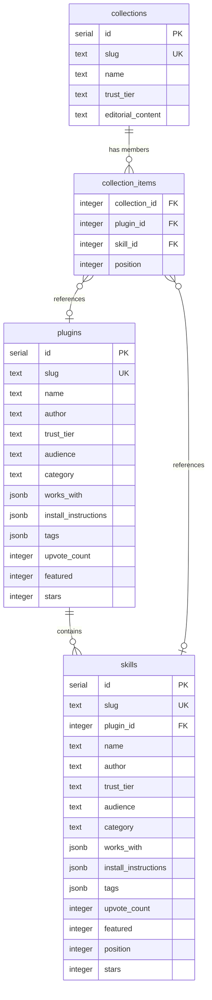

# feat: Plugin-Skill Entity Split with Real Curated Content

## Overview

Split the flat `skills` table into a proper Plugin → Skill hierarchy, replace all 25 fabricated entries with the 16 real curated entries from the original spec, and update the homepage, browse page, detail pages, collections, and all supporting infrastructure to work with the new data model. Plugins are installable packages that contain one or more child skills; skills can also stand alone. Collections can reference a mix of both.

## Problem Statement

Two intertwined problems drive this work (see origin: `docs/brainstorms/2026-03-21-information-architecture-plugins-skills-requirements.md`):

1. **Flat data model hides package scope.** A card for "Git Worktree Manager" (one small utility) looks identical to a card for "Compound Engineering" (a 15+ skill toolkit). Users can't tell what they're looking at or compare like-for-like. The single `skills` table has no concept of parent-child relationships.

2. **Fabricated content.** The current 25 seed entries are not real projects. The original spec listed 16 specific curated entries (gstack, Superpowers, PM Skills, Sentry, HashiCorp, etc.) — none of which made it into the seed data. Both problems need to be fixed together since content must conform to the new data model.

## Proposed Solution

Introduce a three-entity data model with separate database tables:

- **Plugin** = an installable package/repo (e.g. gstack, Anthropic Official Skills). Has its own trust tier, author, install instructions, GitHub stats. Contains 1+ child skills.
- **Skill** = a single capability. Either standalone (own trust tier, install instructions) or parented by a plugin (inherits trust tier from parent, may have its own description/audience).
- **Collection** = editorial grouping. References any mix of plugins and standalone skills via a redesigned join table.

Replace all 25 fabricated content entries with the 16 real spec'd entries, properly categorized as plugins (12) or standalone skills (4).

## Technical Approach

### Architecture

The migration touches every layer of the stack:

| Layer | Current | Proposed |
|-------|---------|----------|
| Schema | `skills`, `collections`, `collection_skills` | `plugins`, `skills` (+ `pluginId` FK), `collections`, `collection_items` |
| Content | `content/skills.ts` (25 fake entries) | `content/plugins.ts` (12 real) + `content/skills.ts` (standalone 4 + child skills) |
| Types | `lib/types.ts` — no plugin concept | Add plugin-related types, `SerializedPlugin`, seed types |
| Queries | `db/queries.ts` — skills only | Add plugin queries, update collection queries for mixed membership |
| Pages | `/skills/[slug]`, `/collections/[slug]` | Add `/plugins/[slug]`, update all existing pages |
| Components | `SkillCard`, `SkillBrowser` | Add `PluginCard`, update `SkillBrowser` for unified grid, update homepage sections |
| API | `/api/skills/[slug]/upvote` | Add `/api/plugins/[slug]/upvote` |
| Seed | `scripts/seed.ts` — skills + collections | Handle plugins → skills → collection_items |

### Schema Design

#### New `plugins` table

```typescript
// db/schema.ts
export const plugins = pgTable(
  'plugins',
  {
    id: serial('id').primaryKey(),
    slug: text('slug').notNull().unique(),
    name: text('name').notNull(),
    author: text('author').notNull(),
    authorUrl: text('author_url'),
    description: text('description').notNull(),
    summary: text('summary'),
    trustTier: text('trust_tier').notNull(),
    audience: text('audience').notNull(),
    category: text('category').notNull(),
    githubUrl: text('github_url'),
    stars: integer('stars'),
    forks: integer('forks'),
    lastUpdated: text('last_updated'),
    license: text('license'),
    worksWith: jsonb('works_with').$type<Platform[]>().notNull().default([]),
    installInstructions: jsonb('install_instructions')
      .$type<Record<string, string>>()
      .notNull()
      .default({}),
    tags: jsonb('tags').$type<string[]>().notNull().default([]),
    bestFor: text('best_for'),
    featured: integer('featured').notNull().default(0),
    upvoteCount: integer('upvote_count').notNull().default(0),
    createdAt: timestamp('created_at').defaultNow().notNull(),
    updatedAt: timestamp('updated_at').defaultNow().notNull(),
  },
  (table) => [
    check('valid_plugin_trust_tier',
      sql`${table.trustTier} IN ('official', 'verified', 'community', 'unreviewed', 'flagged')`),
    check('valid_plugin_audience',
      sql`${table.audience} IN ('developer', 'non-technical', 'both')`),
    check('valid_plugin_slug',
      sql`${table.slug} ~ '^[a-z0-9]+(-[a-z0-9]+)*$'`),
    check('valid_plugin_works_with',
      sql`jsonb_typeof(${table.worksWith}) = 'array'`),
    check('valid_plugin_tags',
      sql`jsonb_typeof(${table.tags}) = 'array'`),
    check('valid_plugin_install_instructions',
      sql`jsonb_typeof(${table.installInstructions}) = 'object'`),
    check('plugin_upvote_count_non_negative',
      sql`${table.upvoteCount} >= 0`),
  ],
);
```

#### Updated `skills` table — add `pluginId` FK + `featured` + `position`

```typescript
// Added columns to existing skills table
pluginId: integer('plugin_id').references(() => plugins.id, { onDelete: 'cascade' }),
featured: integer('featured').notNull().default(0),
position: integer('position'),  // ordering within parent plugin
```

- `pluginId` is nullable — null means standalone skill, non-null means child of a plugin.
- `onDelete: 'cascade'` — deleting a plugin removes its child skills (see origin: Key Decisions — full entity split).
- `position` orders child skills within a plugin's detail page.
- `featured` flag for homepage "Featured Skills" section.

#### Redesigned `collection_items` join table (replaces `collection_skills`)

```typescript
export const collectionItems = pgTable(
  'collection_items',
  {
    collectionId: integer('collection_id')
      .notNull()
      .references(() => collections.id, { onDelete: 'cascade' }),
    pluginId: integer('plugin_id')
      .references(() => plugins.id, { onDelete: 'cascade' }),
    skillId: integer('skill_id')
      .references(() => skills.id, { onDelete: 'cascade' }),
    position: integer('position').notNull(),
  },
  (table) => [
    primaryKey({ columns: [table.collectionId, table.position] }),
    check('exactly_one_entity',
      sql`(${table.pluginId} IS NOT NULL AND ${table.skillId} IS NULL)
       OR (${table.pluginId} IS NULL AND ${table.skillId} IS NOT NULL)`),
  ],
);
```

Single join table with nullable `pluginId`/`skillId` + check constraint. Chosen over two separate join tables for simpler ordering (one `position` sequence per collection) and simpler queries (one SELECT to get all items in order). FK constraints remain strong via individual references.

### ERD



### Implementation Phases

#### Phase 1: Foundation — Schema, Types, Content Data

**Estimated effort:** Medium

1. **`lib/types.ts`** — No new enums needed (plugins share `TRUST_TIERS`, `AUDIENCES`, `PLATFORMS`, `CATEGORIES`). Add UI metadata:
   - `ENTITY_TYPE_LABELS` map for "Plugin" / "Skill" display strings

2. **`db/schema.ts`** — As designed above:
   - Add `plugins` table
   - Add `pluginId`, `featured`, `position` columns to `skills`
   - Replace `collection_skills` with `collection_items`
   - Export new types: `Plugin`, `NewPlugin`, `PluginSeed`, `SerializedPlugin`

3. **`content/plugins.ts`** — New file with 12 plugin entries:

   | Plugin | Author | Trust | Audience | Category | Child Skills |
   |--------|--------|-------|----------|----------|-------------|
   | gstack | Garry Tan | verified | developer | development | Think, Plan, Build, Review, Test, Ship, Reflect |
   | Superpowers | Jesse Vincent | verified | developer | development | Multi-agent methodology skills |
   | PM Skills Marketplace | Paweł Huryn | verified | both | productivity | PM workflow skills |
   | Web Quality Skills | Addy Osmani | verified | developer | development | Performance, Accessibility, UX skills |
   | HashiCorp Agent Skills | HashiCorp | official | developer | devops | Terraform, Packer, Vault |
   | Google Workspace CLI | Google | official | both | productivity | Gmail, Drive, Calendar, Sheets |
   | Anthropic Official Skills | Anthropic | official | both | documents | docx, pdf, pptx, xlsx processors |
   | OpenAI Official Skills | OpenAI | official | developer | development | Cloudflare Deploy, Web Games, etc. |
   | Microsoft Azure Skills | Microsoft | official | developer | devops | Azure Storage, M365, React Flow |
   | Trail of Bits Security | Trail of Bits | verified | developer | security | CodeQL Analysis, Semgrep Analysis |
   | Composio Awesome Skills | Composio | community | developer | automation | Various automation/integration skills |
   | Antigravity | Antigravity | community | both | development | Role-based bundles (largest collection) |

4. **`content/skills.ts`** — Replace 25 fabricated entries. New file contains:
   - 4 standalone skills: Sentry Security Review, Vercel Web Interface Guidelines, VibeSec, Frontend Design Skill (Anthropic)
   - Child skills for each of the 12 plugins (nested under a `pluginSlug` reference in the content structure)

5. **`content/collections.ts`** — Rewrite 9 collections to reference new plugin/skill slugs using a new format:

   ```typescript
   type CollectionItemRef =
     | { type: 'plugin'; slug: string }
     | { type: 'skill'; slug: string };

   type CollectionWithRefs = CollectionSeed & { items: CollectionItemRef[] };
   ```

6. **Migration** — Run `npx drizzle-kit generate` to produce the SQL migration, then `npx drizzle-kit push` for dev.

#### Phase 2: Data Layer — Queries, Seed Script, Upvote API

**Estimated effort:** Medium

1. **`db/queries.ts`** — New and updated queries:

   **New plugin queries:**
   - `getAllPlugins()` — all plugins ordered by upvoteCount
   - `getAllPluginCards()` — subset columns for card display, include child skill count via subquery
   - `getPluginBySlug(slug)` — single plugin by slug
   - `getPluginSkills(pluginId)` — child skills ordered by position
   - `getAllPluginSlugs()` — for `generateStaticParams`
   - `getFeaturedPlugins(limit)` — plugins where `featured = 1`

   **Updated skill queries:**
   - `getAllSkillCards()` — add `pluginId` to selected columns; optionally filter to standalone-only for certain views
   - `getSkillBySlug(slug)` — include parent plugin info (join or separate query)
   - `getFeaturedSkills(limit)` — standalone skills where `featured = 1`
   - `getRecentSkills(limit)` — keep as-is (recent standalone + child skills)

   **Updated collection queries:**
   - `getCollectionItems(collectionId)` — LEFT JOIN to both plugins and skills, ordered by position
   - `getCollectionItemCounts(collectionId)` — count of items (replaces `getCollectionSkillCountsByCollectionId`)
   - `getSkillCollections(skillId)` / `getPluginCollections(pluginId)` — reverse lookups

   **Browse query:**
   - `getBrowseItems()` — union of plugin cards + standalone skill cards + child skill cards, each with entity type tag, for unified grid

2. **`scripts/seed.ts`** — Rewrite to handle three-phase insert:
   - Phase A: Upsert plugins
   - Phase B: Upsert skills (standalone first, then child skills with pluginId FK resolution)
   - Phase C: Delete old `collection_skills`, rebuild `collection_items` from new content references
   - Preserve existing `upvote_count` on conflict (current behavior)

3. **Plugin upvote API** — `app/api/plugins/[slug]/upvote/route.ts`:
   - Mirror existing `app/api/skills/[slug]/upvote/route.ts`
   - GET: return current count
   - POST: increment with rate limiting

4. **`lib/upvotes.ts`** — Update localStorage key strategy to distinguish plugin vs skill upvotes (prefix-based: `plugin:slug` vs `skill:slug` or separate storage keys).

5. **`lib/serialize.ts`** — Add `serializePlugin()` mirroring `serializeSkill()`.

#### Phase 3: Components — Cards, Browse, Homepage Sections

**Estimated effort:** Medium-Large

1. **`components/ui/PluginCard.tsx`** — New component:
   - Visual distinction: "Plugin" badge + child skill count
   - Links to `/plugins/${slug}`
   - Shows trust tier, author, platform badges, upvote count, stars (same layout bones as SkillCard)
   - Skill count displayed as "N skills" indicator

2. **`components/ui/SkillCard.tsx`** — Update:
   - If skill has `pluginId`, optionally show "Part of [Plugin Name]" link
   - Otherwise unchanged from current design

3. **`components/sections/SkillBrowser.tsx`** — Major update:
   - Unified grid renders both `PluginCard` and `SkillCard` components
   - Add "Type" filter: All / Plugins / Skills
   - Existing filters (audience, trust, category, platform, sort) apply to both types
   - URL param: `type=plugin|skill|all`
   - Data source: receive both plugin cards and skill cards from server, merge and sort client-side

4. **`components/sections/FeaturedStacks.tsx`** → Rename/split into:
   - `FeaturedPlugins` — featured plugin cards (with skill count)
   - `FeaturedSkills` — featured standalone skill cards
   - Or a single `FeaturedSection` component that takes a title prop and renders either type

5. **`components/sections/RecentlyAdded.tsx`** — Update to show recent plugins and skills mixed

6. **`components/ui/UpvoteButton.tsx`** — Parameterize entity type:
   - Accept `entityType: 'plugin' | 'skill'` and `slug`
   - Route to correct API endpoint
   - Use entity-type-prefixed localStorage key

#### Phase 4: Pages, Routes, Sitemap

**Estimated effort:** Medium

1. **`app/plugins/[slug]/page.tsx`** — New plugin detail page:
   - Richer layout than skill pages (see origin: R8)
   - Plugin metadata: trust badge, author, description, editorial summary, GitHub stats, install instructions, platform badges
   - **Child skills list** — prominent section showing all skills with brief descriptions, linking to `/skills/[childSlug]`
   - Upvote button for the plugin
   - "Part of collections" section
   - JSON-LD `SoftwareApplication` structured data
   - `generateStaticParams` from `getAllPluginSlugs()`
   - `generateMetadata` with plugin-specific OG tags

2. **`app/skills/[slug]/page.tsx`** — Update:
   - If skill has a parent plugin, show "Part of [Plugin Name]" breadcrumb/link (see origin: R9)
   - Fetch parent plugin data when `pluginId` is present
   - JSON-LD update to reference parent plugin

3. **`app/page.tsx`** (Homepage) — Update:
   - Replace single `FeaturedStacks` with separate "Featured Plugins" and "Featured Skills" sections (see origin: R6)
   - Update data fetching to use `getFeaturedPlugins()` and `getFeaturedSkills()`
   - Update JSON-LD to include both plugins and skills in ItemList

4. **`app/browse/page.tsx`** — Update:
   - Fetch both plugin cards and skill cards
   - Pass unified data to `SkillBrowser` (now handles both types)

5. **`app/collections/[slug]/page.tsx`** — Update:
   - Use `getCollectionItems()` which returns mixed plugins/skills
   - Render `PluginCard` for plugin items, `SkillCard` for skill items

6. **`app/sitemap.ts`** — Add `/plugins/*` URLs alongside `/skills/*`

7. **`components/layout/Header.tsx`** — Add "Plugins" navigation link if appropriate

#### Phase 5: Cleanup and Polish

**Estimated effort:** Small

1. Remove `collection_skills` references throughout codebase
2. Update `CLAUDE.md` to document new entity model and file structure
3. Run full build to verify no broken imports/types
4. Verify ISR revalidation works for new plugin pages

## Alternative Approaches Considered

### Visual-only distinction (type field on skills table)

Add a `type: 'plugin' | 'skill'` column to the existing `skills` table instead of a separate `plugins` table. Simpler migration but conflates two different entities in one table. Rejected because: future features (hero images, longer editorial copy, plugin-level install instructions) would keep adding plugin-specific nullable columns to an already wide table. The full entity split gives a cleaner foundation (see origin: Key Decisions).

### Two separate collection join tables

`collection_plugins` + `collection_skills` instead of a single `collection_items` with nullable FKs. Provides stronger individual FK constraints but makes unified ordering across a collection require a UNION query. Rejected for query simplicity — the check constraint on `collection_items` provides equivalent integrity with simpler access patterns.

### Polymorphic collection join (`entity_type` + `entity_id`)

Single `entity_id` column with `entity_type: 'plugin' | 'skill'` discriminator. Maximum flexibility but no FK constraints at all — the database can't enforce that `entity_id` actually exists in the referenced table. Rejected for data integrity.

### Keep fabricated entries alongside real ones

Add the 16 real entries without removing the 25 fabricated ones. Would be faster but creates a confusing mix of real and fake content. Rejected because content accuracy is a core requirement (see origin: R14 — "Replace all 25 current fabricated entries").

## System-Wide Impact

### Interaction Graph

- **Seed script** writes plugins → triggers skills insert (FK dependency) → triggers collection_items rebuild
- **Plugin delete** cascades to child skills (ON DELETE CASCADE) → cascades to collection_items referencing those skills
- **Upvote POST** on plugin → increments `plugins.upvote_count` → affects browse page sort order on next ISR revalidation (60s)
- **ISR revalidation** (`revalidate = 60`) applies to homepage, browse, plugin detail, skill detail — no change to revalidation strategy needed

### Error & Failure Propagation

- **Seed failure:** Transaction wraps all inserts — partial failure rolls back entirely (existing behavior in `scripts/seed.ts`)
- **Missing plugin for child skill:** Seed script should validate all `pluginSlug` references resolve before inserting skills; warn + skip on mismatch (mirrors current `skillSlugs` warning pattern)
- **Upvote API errors:** Same rate limiting and error handling as existing skill upvote route; plugin upvote route mirrors the pattern exactly
- **404 for removed slugs:** All 25 current slugs will 404 after migration. No redirects needed since entries are fabricated (no external links to preserve)

### State Lifecycle Risks

- **Migration ordering:** Must create `plugins` table before adding `pluginId` FK on `skills`; must drop `collection_skills` after `collection_items` is populated. The Drizzle migration handles table creation order; the seed script handles data migration order.
- **Orphaned collection items:** ON DELETE CASCADE on both `pluginId` and `skillId` FKs in `collection_items` prevents orphaned rows.
- **Upvote localStorage:** Existing upvoted slugs in users' localStorage will no longer match any entries. No user impact since current entries are fabricated — users won't have real upvote history to preserve.

### API Surface Parity

| Interface | Skills (existing) | Plugins (new) |
|-----------|-------------------|---------------|
| Detail page | `/skills/[slug]` | `/plugins/[slug]` |
| Upvote GET | `/api/skills/[slug]/upvote` | `/api/plugins/[slug]/upvote` |
| Upvote POST | `/api/skills/[slug]/upvote` | `/api/plugins/[slug]/upvote` |
| Browse card | `SkillCard` component | `PluginCard` component |
| Sitemap | `skills/*` entries | `plugins/*` entries |
| JSON-LD | `SoftwareApplication` | `SoftwareApplication` |

### Integration Test Scenarios

1. **Seed → browse → filter by type:** Run seed, load `/browse?type=plugin`, verify only plugin cards appear with correct skill counts.
2. **Plugin detail → child skill → back to plugin:** Navigate `/plugins/gstack` → click child skill "Think" → verify breadcrumb links back to `/plugins/gstack`.
3. **Collection with mixed members:** Load a collection containing both a plugin and a standalone skill → verify correct card types rendered in position order.
4. **Plugin upvote → browse sort:** Upvote a plugin → wait for ISR → verify browse page sort order reflects new count.
5. **Plugin delete cascade:** (Test via seed script) Remove a plugin from content → re-seed → verify child skills and collection_items rows are cleaned up.

## Acceptance Criteria

### Functional Requirements

- [ ] `plugins` table exists with all specified columns and constraints
- [ ] `skills` table has `plugin_id` FK, `featured`, and `position` columns
- [ ] `collection_items` table replaces `collection_skills` with mixed plugin/skill support
- [ ] All 12 plugins from the spec are seeded with accurate, real content
- [ ] All 4 standalone skills from the spec are seeded with accurate, real content
- [ ] Each plugin has its child skills enumerated and seeded
- [ ] `/plugins/[slug]` page renders plugin details + child skills list
- [ ] `/skills/[slug]` page shows parent plugin link when applicable
- [ ] Homepage has separate "Featured Plugins" and "Featured Skills" sections
- [ ] Browse page shows unified grid with visual differentiation (Plugin badge + skill count)
- [ ] Browse page "Type" filter works (All / Plugins / Skills)
- [ ] Plugin cards show "Plugin" indicator and child skill count
- [ ] Collections can contain both plugins and standalone skills
- [ ] Plugin upvote API works (GET + POST)
- [ ] Sitemap includes `/plugins/*` URLs

### Non-Functional Requirements

- [ ] ISR revalidation continues to work (60s) for all pages
- [ ] Plugin detail pages are statically generated (`generateStaticParams`)
- [ ] No regression in existing skill card rendering
- [ ] Build succeeds with `output: 'standalone'` for Railway
- [ ] All Drizzle check constraints pass for new/updated tables

### Quality Gates

- [ ] `npm run build` passes without errors
- [ ] Seed script runs successfully against dev DB
- [ ] All 16 spec'd entries visible and browsable in the UI
- [ ] No broken links between plugin ↔ child skill ↔ collection pages

## Success Metrics

Directly from the origin document:

- A user browsing the homepage can immediately distinguish between plugins (installable packages) and individual skills
- A user viewing a plugin detail page can see all skills it contains and understand the plugin as a coherent package
- All 16 spec'd entries are present with accurate attribution and correct entity type
- The browse/search page lets users filter and find both plugins and skills in a unified experience
- Collections can contain a mix of plugins and standalone skills

## Dependencies & Prerequisites

- PostgreSQL database accessible (Railway dev instance)
- Drizzle Kit available for migration generation
- Public information available for all 16 spec'd entries to write accurate content
- No blocking P1 issues (existing todos are independent of this work)

## Risk Analysis & Mitigation

| Risk | Likelihood | Impact | Mitigation |
|------|-----------|--------|------------|
| Content accuracy — real entries may have stale GitHub stats or changed features | Medium | Low | Note "as of March 2026" in content; stats are best-effort for curated entries |
| Migration breaks existing upvote counts | Low | Low | Current entries are fabricated; no real upvote history to preserve |
| Child skill enumeration varies — some plugins have unclear skill boundaries | Medium | Medium | Start with obvious named skills; can add more granularity later |
| Browse page performance with mixed-type query | Low | Medium | MVP catalog is <50 items total; optimize later if needed |
| Collection ordering complexity with single join table | Low | Low | Check constraint + position-based PK provides sufficient integrity |

## Entity Categorization

### Plugins (12)

| # | Name | Author | Trust Tier | Audience | Category | Approx. Child Skills |
|---|------|--------|------------|----------|----------|---------------------|
| 1 | gstack | Garry Tan | verified | developer | development | ~7 (Think, Plan, Build, Review, Test, Ship, Reflect) |
| 2 | Superpowers | Jesse Vincent | verified | developer | development | ~4-6 (multi-agent methodology) |
| 3 | PM Skills Marketplace | Paweł Huryn | verified | both | productivity | ~4-5 (PM workflow) |
| 4 | Web Quality Skills | Addy Osmani | verified | developer | development | ~3-4 (performance, accessibility, UX) |
| 5 | HashiCorp Agent Skills | HashiCorp | official | developer | devops | ~3 (Terraform, Packer, Vault) |
| 6 | Google Workspace CLI | Google | official | both | productivity | ~4 (Gmail, Drive, Calendar, Sheets) |
| 7 | Anthropic Official Skills | Anthropic | official | both | documents | ~4-5 (docx, pdf, pptx, xlsx processors) |
| 8 | OpenAI Official Skills | OpenAI | official | developer | development | ~3-4 (Cloudflare Deploy, Web Games, etc.) |
| 9 | Microsoft Azure Skills | Microsoft | official | developer | devops | ~3-4 (Azure Storage, M365, React Flow) |
| 10 | Trail of Bits Security | Trail of Bits | verified | developer | security | ~2-3 (CodeQL, Semgrep) |
| 11 | Composio Awesome Skills | Composio | community | developer | automation | ~5-6 (automation/integration tools) |
| 12 | Antigravity | Antigravity | community | both | development | ~10+ representative skills (from 1,200+ catalog) |

### Standalone Skills (4)

| # | Name | Author | Trust Tier | Audience | Category |
|---|------|--------|------------|----------|----------|
| 1 | Sentry Security Review | Sentry | verified | developer | security |
| 2 | Vercel Web Interface Guidelines | Vercel | verified | developer | design |
| 3 | VibeSec | Community | community | developer | security |
| 4 | Frontend Design Skill | Anthropic | official | developer | design |

## Future Considerations

- **Hero images** on plugin detail pages (R8 notes this as future direction — schema could add `heroImageUrl` to plugins later)
- **Longer-form editorial copy** on plugin pages (App Store-style featured apps)
- **Plugin-level install instructions** that install all child skills at once
- **Aggregated upvote display** — show sum of child skill upvotes on the plugin card alongside the plugin's own upvotes
- **Skill comparison** feature (still deferred) — would need to handle plugin-vs-skill comparisons

## Documentation Plan

- [ ] Update `CLAUDE.md` — document new entity model, `content/plugins.ts` file, plugin queries, `/plugins/[slug]` route
- [ ] Update `db/schema.ts` inline documentation if any
- [ ] Content files should include source URLs for each real entry as comments

## Sources & References

### Origin

- **Origin document:** [docs/brainstorms/2026-03-21-information-architecture-plugins-skills-requirements.md](docs/brainstorms/2026-03-21-information-architecture-plugins-skills-requirements.md) — Key decisions carried forward: full entity split over visual-only distinction, separate URL namespaces (`/plugins/[slug]`, `/skills/[slug]`), replace all fabricated entries with 16 real spec'd entries, upvotes on both entity types.

### Internal References

- Product spec: `skillstube-mvp-spec.md` — curated entries list (lines 41–56), trust tiers, information architecture
- Previous plan: `docs/plans/2026-03-20-001-feat-skillstube-mvp-beta-plan.md` — original MVP implementation plan
- Current schema: `db/schema.ts` — existing table definitions
- Current queries: `db/queries.ts` — existing query patterns to mirror for plugins
- Current content: `content/skills.ts`, `content/collections.ts` — structure patterns for new content files
- Types: `lib/types.ts` — const array enum pattern, `TRUST_TIER_META` for UI metadata
- Seed: `scripts/seed.ts` — upsert + conflict handling + transaction pattern
- Security learnings: `docs/solutions/security-issues/rate-limit-host-header-xss-hsts-hardening.md` — rate limiter patterns relevant to new upvote API

### SpecFlow Analysis Highlights

- **Plugin delete cascade** — confirmed appropriate given curated content model
- **Collection join table** — single table with nullable FKs + check constraint chosen for query simplicity
- **Browse child skill visibility** — child skills appear as separate rows in browse grid for maximum discoverability
- **Trust tier inheritance** — denormalized on child skills during seeding for query simplicity
- **URL migration** — clean replacement, no redirects needed (fabricated entries have no external links)
